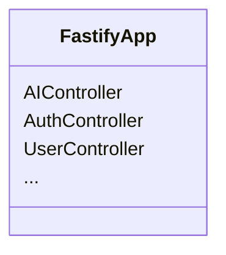
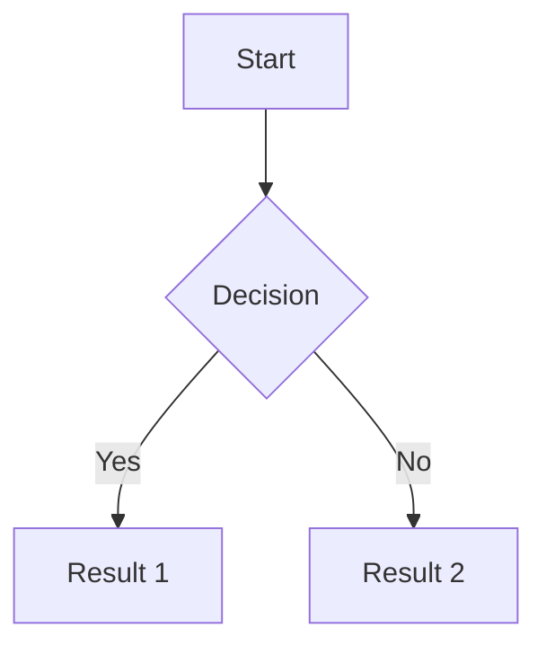

# Mermaid Diagram Viewer

View Mermaid diagrams from Markdown files in your browser with live rendering.

## Usage

### View DI Container Diagram

```bash
pnpm mermaid:di
```

This will serve the `di:container.md` file at `http://localhost:3001`

### View Any Mermaid File

```bash
pnpm mermaid path/to/your/diagram.md
```

For example:

```bash
pnpm mermaid docs/architecture.md
```

## Features

- 🎨 Beautiful gradient UI with Material Design
- 📊 Live Mermaid.js rendering
- 🔄 Toggle source code view
- 🖨️ Print-friendly layout
- 📱 Responsive design
- 🔍 Enhanced viewing controls:
  - 250% initial zoom for better readability
  - On-screen zoom controls
  - Keyboard shortcuts: <kbd>Ctrl</kbd>/<kbd>Cmd</kbd> + <kbd>+</kbd> to zoom in, <kbd>Ctrl</kbd>/<kbd>Cmd</kbd> + <kbd>-</kbd> to zoom out
  - Mouse wheel zoom
  - Click-and-drag panning of the diagram

## Supported Diagram Types

The viewer supports all Mermaid diagram types:

- **Flowcharts**: Process flows and decision trees
- **Sequence diagrams**: Interactions between components
- **Class diagrams**: Object-oriented structures (like `di:container.md`)
- **State diagrams**: State machines
- **Entity relationship diagrams**: Database schemas
- **Gantt charts**: Project timelines
- **Pie charts**: Data visualization
- **Git graphs**: Repository history
- And more!

## Example: DI Container Diagram

The `di:container.md` file contains a class diagram showing the dependency injection container structure:



## Stopping the Server

Press `Ctrl+C` in the terminal to stop the server.

## Technical Details

- **Server**: Node.js HTTP server (port 3001)
- **Runtime**: tsx (TypeScript execution)
- **Mermaid**: Loaded via CDN (v11)
- **No build step required**: Direct TypeScript execution

## Adding New Diagrams

1. Create a `.md` file with Mermaid syntax:



2. View it:

```bash
pnpm mermaid path/to/diagram.md
```

## Troubleshooting

### Port Already in Use

If port 3001 is already in use, edit `scripts/serve-mermaid.ts` and change the `PORT` constant.

### File Not Found

Make sure the path is relative to the `apps/backend` directory.

## Learn More

- [Mermaid.js Documentation](https://mermaid.js.org/)
- [Mermaid Live Editor](https://mermaid.live/) - Test your diagrams online
