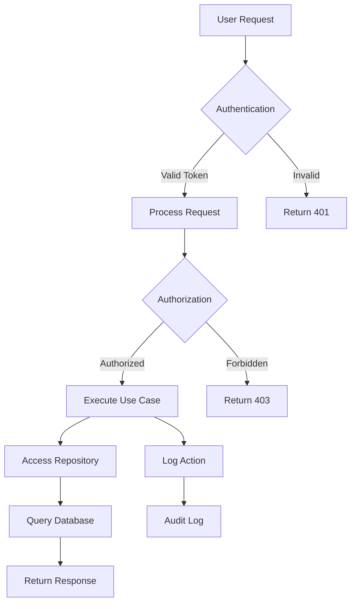

# Backend Architecture Flow

This diagram shows the typical flow of a request through the backend:

1. **User Request** arrives at the API endpoint
2. **Authentication** validates the JWT token
3. **Authorization** checks user permissions
4. **Use Case** executes business logic
5. **Repository** handles data access
6. **Database** stores/retrieves data
7. **Audit Log** records the action
