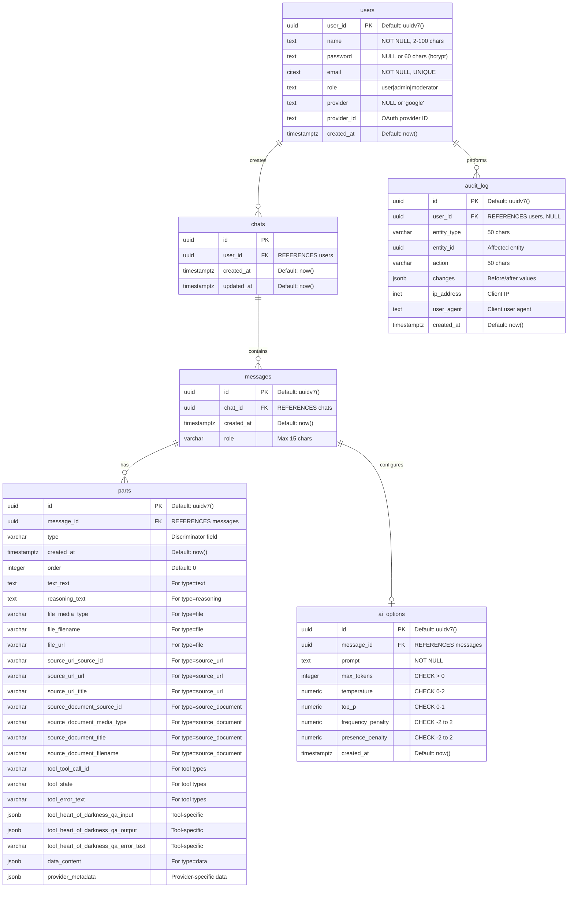

# Database Entity Relationship Diagram (ERD)

## Schema Overview

This ERD represents the database schema for the AI chat application with user authentication, chat management, and audit logging.

## Table Descriptions

### **users**

Stores user accounts with support for both password-based and OAuth authentication (Google).

- **Primary Key**: `user_id` (UUID v7)
- **Unique Constraint**: `email` (case-insensitive via CITEXT)
- **Roles**: user, admin, moderator
- **OAuth Support**: Google provider with provider_id

### **chats**

Stores chat sessions created by users.

- **Primary Key**: `id` (UUID)
- **Foreign Key**: `user_id` → users(user_id) with CASCADE DELETE
- **Indexes**:
  - `chats_user_id_idx`
  - `chats_user_id_updated_at_idx` (for sorting chat history)

### **messages**

Stores individual messages within chat sessions.

- **Primary Key**: `id` (UUID v7)
- **Foreign Key**: `chat_id` → chats(id) with CASCADE DELETE
- **Role**: Limited to 15 characters
- **Indexes**:
  - `messages_chat_id_idx`
  - `messages_chat_id_created_at_idx`

### **ai_options**

Stores AI model configuration parameters for each message.

- **Primary Key**: `id` (UUID v7)
- **Foreign Key**: `message_id` → messages(id) with CASCADE DELETE
- **Parameters**:
  - `max_tokens`: Must be positive
  - `temperature`: Range 0-2
  - `top_p`: Range 0-1
  - `frequency_penalty`: Range -2 to 2
  - `presence_penalty`: Range -2 to 2
- **Index**: `ai_options_message_id_idx`

### **parts**

Polymorphic table storing different types of message content.

- **Primary Key**: `id` (UUID v7)
- **Foreign Key**: `message_id` → messages(id) with CASCADE DELETE
- **Type Discriminator**: Determines which fields are required
- **Supported Types**:
  - `text`: Text content (requires `text_text`)
  - `reasoning`: AI reasoning (requires `reasoning_text`)
  - `file`: File attachments (requires `file_media_type`, `file_url`)
  - `source_url`: URL references (requires `source_url_source_id`, `source_url_url`)
  - `source_document`: Document references (requires `source_document_source_id`, `source_document_media_type`, `source_document_title`)
  - `data`: Custom data (requires `data_content` JSONB)
  - `tool-*`: Tool calls with specific fields
- **Indexes**:
  - `parts_message_id_idx`
  - `parts_message_id_order_idx`

### **audit_log**

Tracks all significant system actions for security and compliance.

- **Primary Key**: `id` (UUID v7)
- **Foreign Key**: `user_id` → users(user_id) with SET NULL (nullable for system actions)
- **Entity Tracking**: Records entity type and ID
- **Action Types**: create, update, delete, login, logout, etc.
- **Metadata**: Changes (JSONB), IP address, user agent
- **Indexes**:
  - `audit_log_user_id_idx`
  - `audit_log_entity_type_entity_id_idx`
  - `audit_log_created_at_idx` (descending for recent first)
  - `audit_log_action_idx`

## Relationships

1. **users → chats**: One-to-Many (1:N)
   - One user can create multiple chat sessions
   - Cascade delete: Deleting a user removes all their chats

2. **chats → messages**: One-to-Many (1:N)
   - One chat contains multiple messages
   - Cascade delete: Deleting a chat removes all its messages

3. **messages → parts**: One-to-Many (1:N)
   - One message can have multiple parts (text, files, tools, etc.)
   - Cascade delete: Deleting a message removes all its parts

4. **messages → ai_options**: One-to-One (1:1)
   - Each message has one set of AI configuration parameters
   - Cascade delete: Deleting a message removes its AI options

5. **users → audit_log**: One-to-Many (1:N)
   - One user can have multiple audit log entries
   - Set null on delete: Deleting a user preserves audit history

## Key Features

### UUID v7 for Primary Keys

Most tables use UUID v7 for primary keys, which provides:

- Time-ordered UUIDs for better database performance
- Globally unique identifiers
- Better indexing compared to UUID v4

### Polymorphic Parts Table

The `parts` table uses a type discriminator pattern with CHECK constraints to ensure data integrity based on the part type.

### Audit Trail

Complete audit logging with:

- User actions tracking
- Entity type and ID for affected resources
- Before/after changes in JSONB format
- Client information (IP, user agent)
- Indexed for efficient querying

### OAuth Support

Users table supports both traditional password authentication and OAuth providers (currently Google).

### Cascade Deletes

Proper cascade deletion ensures referential integrity:

- Deleting a user removes their chats, which removes messages and parts
- Audit logs are preserved with NULL user_id for historical records
