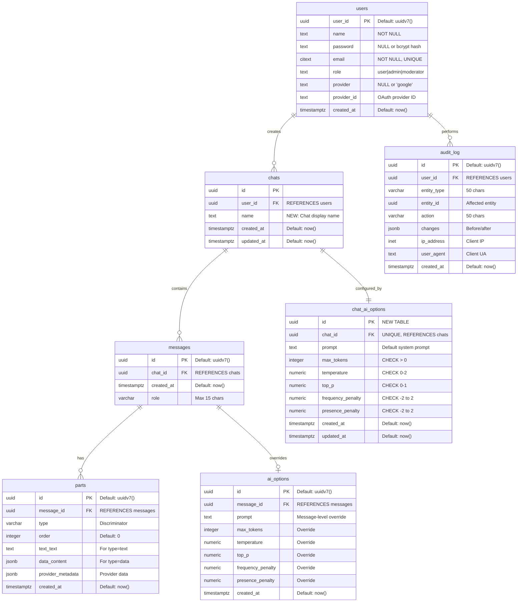

# Proposed ERD: Named Chats with Configuration Options

## Overview

This proposal adds support for named chats where each chat has its own AI configuration options, allowing users to create multiple chats with different names and different AI model settings.

## Changes Required

### 1. Add `name` column to `chats` table

### 2. Add `chat_ai_options` table to store chat-level AI configurations

### 3. Keep existing `ai_options` table for message-level overrides (optional)

---

## Proposed Entity Relationship Diagram



---

## Detailed Changes

### Change 1: Add `name` to `chats` table

```sql
-- Add name column to existing chats table
ALTER TABLE chats
ADD COLUMN name TEXT NOT NULL DEFAULT 'Untitled Chat'
CHECK (length(name) >= 1 AND length(name) <= 200);

-- Add index for searching chats by name
CREATE INDEX chats_user_id_name_idx ON chats(user_id, name);

-- Update comment
COMMENT ON COLUMN chats.name IS 'Display name for the chat, user-defined (1-200 characters)';
```

**Benefits:**

- Users can identify chats by name
- Search/filter chats by name
- Better UX in chat list

---

### Change 2: Create `chat_ai_options` table

```sql
-- Create new table for chat-level AI configuration
CREATE TABLE chat_ai_options (
    id UUID PRIMARY KEY DEFAULT uuidv7(),
    chat_id UUID NOT NULL UNIQUE REFERENCES chats(id) ON DELETE CASCADE,
    prompt TEXT NOT NULL DEFAULT 'You are a helpful AI assistant.',
    max_tokens INTEGER NOT NULL DEFAULT 2000 CHECK (max_tokens > 0 AND max_tokens <= 100000),
    temperature NUMERIC NOT NULL DEFAULT 0.7 CHECK (temperature >= 0 AND temperature <= 2),
    top_p NUMERIC NOT NULL DEFAULT 1.0 CHECK (top_p >= 0 AND top_p <= 1),
    frequency_penalty NUMERIC NOT NULL DEFAULT 0.0 CHECK (frequency_penalty >= -2 AND frequency_penalty <= 2),
    presence_penalty NUMERIC NOT NULL DEFAULT 0.0 CHECK (presence_penalty >= -2 AND presence_penalty <= 2),
    created_at TIMESTAMPTZ NOT NULL DEFAULT now(),
    updated_at TIMESTAMPTZ NOT NULL DEFAULT now()
);

-- Index for efficient lookup
CREATE UNIQUE INDEX chat_ai_options_chat_id_idx ON chat_ai_options(chat_id);

-- Comments
COMMENT ON TABLE chat_ai_options IS 'Stores default AI model configuration for each chat';
COMMENT ON COLUMN chat_ai_options.chat_id IS 'One-to-one relationship with chats table';
COMMENT ON COLUMN chat_ai_options.prompt IS 'System prompt/context for this chat';
COMMENT ON COLUMN chat_ai_options.updated_at IS 'Track when configuration was last modified';
```

**Benefits:**

- Each chat has its own AI configuration
- Default settings for all messages in the chat
- Can be updated independently per chat
- Users can create different chats for different purposes:
  - "Creative Writing" (temperature: 1.2, prompt: "You are a creative writer...")
  - "Code Review" (temperature: 0.2, prompt: "You are a code reviewer...")
  - "General Chat" (temperature: 0.7, prompt: "You are a helpful assistant...")

---

### Change 3: Keep `ai_options` for message-level overrides (Optional)

The existing `ai_options` table can remain linked to messages for per-message configuration overrides. This provides flexibility:

- **Chat-level**: Default configuration in `chat_ai_options`
- **Message-level**: Override configuration in `ai_options` (optional)

**Logic:**

```
If message has ai_options:
    Use message ai_options
Else:
    Use chat's chat_ai_options
```

**Alternative:** If message-level overrides are not needed, the `ai_options` table can be dropped entirely.

---

## Migration Strategy

### Step 1: Add name column to chats

```sql
-- Migration: Add name with default value
ALTER TABLE chats
ADD COLUMN name TEXT NOT NULL DEFAULT 'Untitled Chat'
CHECK (length(name) >= 1 AND length(name) <= 200);

-- Create index
CREATE INDEX chats_user_id_name_idx ON chats(user_id, name);
```

### Step 2: Create chat_ai_options table

```sql
-- Migration: Create new table
CREATE TABLE chat_ai_options (
    id UUID PRIMARY KEY DEFAULT uuidv7(),
    chat_id UUID NOT NULL UNIQUE REFERENCES chats(id) ON DELETE CASCADE,
    prompt TEXT NOT NULL DEFAULT 'You are a helpful AI assistant.',
    max_tokens INTEGER NOT NULL DEFAULT 2000 CHECK (max_tokens > 0 AND max_tokens <= 100000),
    temperature NUMERIC NOT NULL DEFAULT 0.7 CHECK (temperature >= 0 AND temperature <= 2),
    top_p NUMERIC NOT NULL DEFAULT 1.0 CHECK (top_p >= 0 AND top_p <= 1),
    frequency_penalty NUMERIC NOT NULL DEFAULT 0.0 CHECK (frequency_penalty >= -2 AND frequency_penalty <= 2),
    presence_penalty NUMERIC NOT NULL DEFAULT 0.0 CHECK (presence_penalty >= -2 AND presence_penalty <= 2),
    created_at TIMESTAMPTZ NOT NULL DEFAULT now(),
    updated_at TIMESTAMPTZ NOT NULL DEFAULT now()
);

CREATE UNIQUE INDEX chat_ai_options_chat_id_idx ON chat_ai_options(chat_id);
```

### Step 3: Migrate existing data (if needed)

```sql
-- If existing chats need default AI options
INSERT INTO chat_ai_options (chat_id, prompt, max_tokens, temperature, top_p, frequency_penalty, presence_penalty)
SELECT
    c.id,
    'You are a helpful AI assistant.',
    2000,
    0.7,
    1.0,
    0.0,
    0.0
FROM chats c
WHERE NOT EXISTS (
    SELECT 1 FROM chat_ai_options cao WHERE cao.chat_id = c.id
);
```

### Step 4: Update application code

- Create new repository methods for `chat_ai_options`
- Update chat creation to include name and AI options
- Update chat list to display names
- Add UI for editing chat names and configurations

---

## Example Usage Scenarios

### Scenario 1: Create a new chat with custom settings

```sql
-- 1. Create chat
INSERT INTO chats (id, user_id, name)
VALUES (uuidv7(), 'user-123', 'Python Coding Assistant');

-- 2. Configure AI options for this chat
INSERT INTO chat_ai_options (chat_id, prompt, temperature, max_tokens)
VALUES (
    'chat-id',
    'You are an expert Python developer. Provide concise, well-documented code.',
    0.3,
    4000
);
```

### Scenario 2: Create multiple chats with different purposes

```sql
-- Creative Writing Chat
INSERT INTO chats (id, user_id, name) VALUES (uuidv7(), 'user-123', 'Creative Writing');
INSERT INTO chat_ai_options (chat_id, prompt, temperature, max_tokens)
VALUES ('chat-1', 'You are a creative writing assistant.', 1.2, 3000);

-- Technical Support Chat
INSERT INTO chats (id, user_id, name) VALUES (uuidv7(), 'user-123', 'Tech Support');
INSERT INTO chat_ai_options (chat_id, prompt, temperature, max_tokens)
VALUES ('chat-2', 'You are a technical support specialist.', 0.5, 2000);

-- General Chat
INSERT INTO chats (id, user_id, name) VALUES (uuidv7(), 'user-123', 'General Questions');
INSERT INTO chat_ai_options (chat_id, prompt, temperature, max_tokens)
VALUES ('chat-3', 'You are a helpful assistant.', 0.7, 2000);
```

### Scenario 3: Update chat name and configuration

```sql
-- Update chat name
UPDATE chats SET name = 'Advanced Python Debugging', updated_at = now()
WHERE id = 'chat-id';

-- Update AI configuration
UPDATE chat_ai_options
SET
    prompt = 'You are an expert in Python debugging and performance optimization.',
    temperature = 0.4,
    updated_at = now()
WHERE chat_id = 'chat-id';
```

---

## New Relationships Summary

1. **chats → chat_ai_options**: One-to-One (1:1) ⭐ NEW
   - Each chat has exactly one AI configuration
   - Cascade delete: Deleting a chat removes its configuration
   - UNIQUE constraint on `chat_id` enforces 1:1 relationship

2. **users → chats**: One-to-Many (1:N) - Existing
   - Enhanced with name field for better organization

3. **messages → ai_options**: One-to-One (1:1) - Existing (Optional)
   - Can be kept for message-level overrides
   - Or removed if not needed

---

## Database Constraints & Validation

### chats.name

- **Type**: TEXT
- **Constraints**:
  - NOT NULL
  - CHECK (length >= 1 AND length <= 200)
- **Default**: 'Untitled Chat'
- **Index**: Composite index on (user_id, name) for fast filtering

### chat_ai_options

- **Foreign Key**: chat_id UNIQUE → chats(id) ON DELETE CASCADE
- **Constraints**:
  - All AI parameters have valid ranges
  - prompt is NOT NULL with sensible default
  - Timestamps auto-managed
- **Index**: Unique index on chat_id for efficient 1:1 lookups

---

## Benefits of This Approach

✅ **Named Chats**: Users can organize conversations with meaningful names  
✅ **Per-Chat Configuration**: Each chat can have different AI settings  
✅ **Flexibility**: Create specialized chats for different tasks  
✅ **User Experience**: Easy to switch between different AI personalities/modes  
✅ **Backward Compatible**: Existing chats get default values  
✅ **Performance**: Indexed lookups for fast retrieval  
✅ **Data Integrity**: Foreign key constraints ensure consistency

---

## Alternative Approach: Reuse Existing ai_options

If you prefer not to create a new table, you could:

1. Add `chat_id` FK to existing `ai_options` table
2. Make `message_id` nullable
3. Add CHECK constraint: either chat_id or message_id must be set

However, the **new `chat_ai_options` table approach is recommended** because:

- Clearer separation of concerns
- Better performance (no nullable FKs)
- Easier to reason about (1:1 relationship)
- Simpler queries (no conditional logic)
